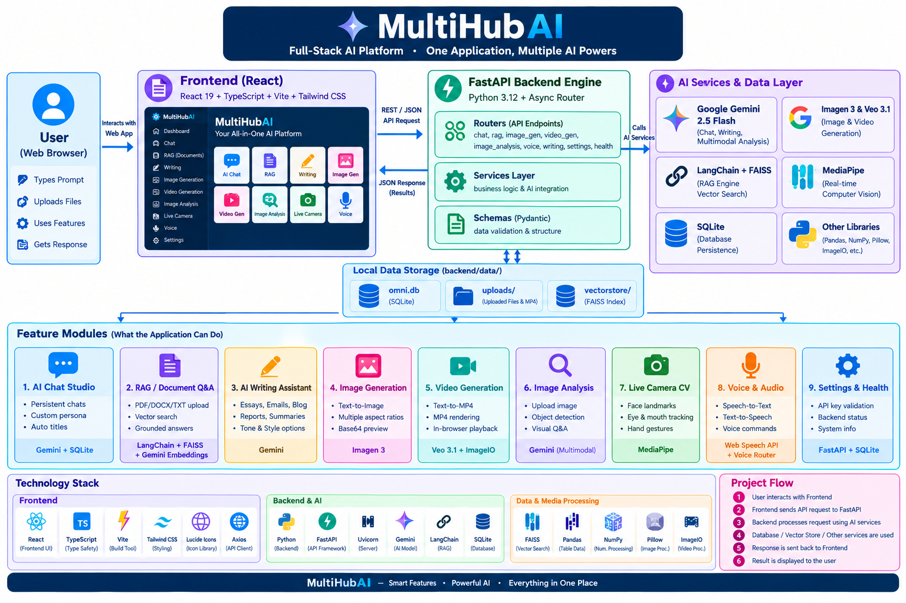

# 🤖 MultiHubAI Assistant — Full-Stack AI Platform

[](https://react.dev/)
[](https://fastapi.tiangolo.com/)
[](https://www.python.org/)
[](https://www.typescriptlang.org/)
[](https://tailwindcss.com/)
[](https://ai.google.dev/)
[](LICENSE)

**MultiHubAI Assistant** is an all-in-one, enterprise-grade, full-stack Artificial Intelligence platform. It combines generative LLMs, RAG (Retrieval-Augmented Generation), multimodal image and video synthesis, real-time MediaPipe computer vision, dynamic audio processing, and local database persistence into a single web application.

---

## 📸 Architecture Diagram

```
                                  ┌───────────────────────────────┐
                                  │   MultiHubAI Web Dashboard    │
                                  │ React 19 + Vite + Tailwind v4 │
                                  └──────────────┬────────────────┘
                                                 │ REST / JSON
                                                 ▼
                                  ┌───────────────────────────────┐
                                  │      FastAPI Backend Engine   │
                                  │   Python 3.12 + Async Router  │
                                  └──────────────┬────────────────┘
                                                 │
      ┌────────────────┬─────────────────┼──────────────────┬─────────────────┐
      ▼                ▼                 ▼                  ▼                 ▼
┌───────────┐    ┌───────────┐     ┌───────────┐      ┌───────────┐    ┌─────────────┐
│  Gemini   │    │  FAISS &  │     │ Imagen 3  │      │ MediaPipe │    │   SQLite    │
│ 2.5 Flash │    │ LangChain │     │  & Veo    │      │ Vision AI │    │ Persistence │
│ Chat Engine│   │ RAG Engine│     │ Media Gen │      │ Real-time │    │ History/Docs│
└───────────┘    └───────────┘     └───────────┘      └───────────┘    └─────────────┘
```

---

## ✨ Features & Modules Overview

### 1. 💬 AI Chat Studio
* **Powered by**: Google Gemini 2.5 Flash API & SQLite (`multihub.db`).
* **Capabilities**:
  * Persistent conversation threads with real-time sidebar switching.
  * Custom System Persona definition (e.g., Coding Mentor, Creative Writer, Technical Auditor).
  * Auto-summarized thread titles based on conversation context.

### 2. 📚 Document-Based RAG Engine
* **Powered by**: FAISS Vector Index, LangChain, Gemini Embeddings (`models/gemini-embedding-001`).
* **Capabilities**:
  * Multi-format document ingestion: PDF, DOCX, TXT.
  * Smart chunking & vector store persistence in `backend/data/vectorstore`.
  * Zero-hallucination Q&A mode grounded strictly in uploaded documents with snippet source citations.

### 3. ✍️ AI Writing Assistant Suite
* **Capabilities**:
  * Multi-genre document creation: Essays, Professional Emails, Blog Posts, Technical Reports, Summaries, and Text Rewriting.
  * Customizable Tone & Style options (Formal, Conversational, Technical, Academic, Persuasive).

### 4. 🎨 AI Image Generation Studio
* **Powered by**: Google Imagen 3.0 & Fallback Synthesis Engine.
* **Capabilities**:
  * Text-to-Image generation with configurable aspect ratios (`1:1`, `16:9`, `9:16`, `4:3`, `3:4`).
  * Direct Base64 data streaming & visual preview library.

### 5. 🎬 AI Video Synthesis Studio
* **Powered by**: Google Veo 3.1 Preview API & Dynamic ImageIO MP4 Rendering Engine.
* **Capabilities**:
  * Text-to-MP4 dynamic animation and video rendering.
  * Local video asset streaming (`/api/video/file/{filename}`) for seamless in-browser playback.

### 6. 🔍 Multimodal Visual Analysis
* **Powered by**: Gemini 2.5 Flash Multimodal Vision API.
* **Capabilities**:
  * Image upload inspection with detailed object identification, scene context analysis, and visual Q&A.

### 7. 📹 Real-Time Live Camera Computer Vision
* **Powered by**: Google MediaPipe Vision Tasks API (`@mediapipe/tasks-vision`).
* **Capabilities**:
  * In-browser zero-latency facial landmark estimation, eye openness tracker, mouth position analysis, and hand gesture recognition directly via webcam feed.

### 8. 🎙️ Voice & Audio Synthesis Studio
* **Powered by**: Web Speech API (SpeechRecognition & SpeechSynthesis) + Backend Voice Router.
* **Capabilities**:
  * Hands-free voice commands, instant Speech-to-Text transcription, and natural Text-to-Speech audio feedback.

### 9. ⚙️ System Settings & Health Monitoring
* **Capabilities**:
  * Real-time Gemini API key validation, system storage path checks, and backend ping status.

---

## 🛠️ Technology Stack

| Layer | Technology | Function |
|---|---|---|
| **Frontend UI** | React 19, TypeScript, Vite 8, Tailwind CSS v4 | Component-driven, responsive dark-mode layout |
| **Icons & Media** | Lucide React Icons, Canvas API | Modern SVG icons & dynamic frame drawing |
| **Computer Vision** | Google MediaPipe Vision Tasks | Client-side real-time video frame inference |
| **Backend API** | Python 3.12, FastAPI, Uvicorn | High-performance asynchronous REST backend |
| **LLM & Vision AI** | Google GenAI SDK (`google-genai`), Gemini 2.5 Flash | Conversational reasoning & multimodal analysis |
| **RAG & Vector DB** | LangChain, FAISS (`faiss-cpu`), Gemini Embeddings | Vector similarity search & document retrieval |
| **Video Engine** | ImageIO v3, Pillow, NumPy | Dynamic frame-by-frame MP4 rendering |
| **Database & Data Engine** | Pandas (`pandas`), SQLite (`aiosqlite`), PyPDF, Docx2txt | Tabular data ingestion (.csv, .xlsx), data analytics & persistence |

---

## 📂 Project Directory Structure

```
multihubai-assistant/
├── backend/
│   ├── data/                   # Storage for SQLite DB, uploads & FAISS index
│   │   ├── multihub.db         # Local SQLite database
│   │   ├── uploads/            # Document uploads & generated MP4 files
│   │   └── vectorstore/        # FAISS vector database files
│   ├── routers/                # Modular REST API endpoints
│   │   ├── chat.py             # Chat history & generation endpoints
│   │   ├── health.py           # Backend health status check
│   │   ├── image_analysis.py   # Multimodal image inspection
│   │   ├── image_gen.py        # Text-to-image endpoint
│   │   ├── rag.py              # File upload & document Q&A endpoints
│   │   ├── settings.py         # Gemini API key settings manager
│   │   ├── video_gen.py        # Text-to-video endpoint
│   │   ├── voice.py            # Audio processing endpoint
│   │   └── writing.py          # Writing suite endpoint
│   ├── services/               # Core business & AI logic
│   │   ├── db_service.py       # Async SQLite database service
│   │   ├── document_processor.py # PDF/DOCX loader and splitter
│   │   ├── gemini_service.py   # Google GenAI & Imagen/Veo service
│   │   └── rag_service.py      # LangChain FAISS retrieval engine
│   ├── config.py               # Pydantic environment configuration
│   ├── main.py                 # FastAPI application entry point
│   ├── schemas.py              # Pydantic request/response schemas
│   └── requirements.txt        # Python backend dependencies
├── frontend/
│   ├── src/
│   │   ├── components/         # Common UI layout components
│   │   ├── features/           # Feature pages (chat, rag, writing, etc.)
│   │   ├── services/           # Axios API client integrations
│   │   ├── App.tsx             # Root layout & route view switcher
│   │   └── index.css           # Global Tailwind CSS styling
│   ├── package.json            # Frontend NPM dependencies
│   └── vite.config.ts          # Vite bundler configuration
├── package.json                # Root concurrent scripts
└── README.md                   # Full platform documentation
```

---

## ⚡ Quick Start Guide

### Prerequisites
* **Node.js**: `v20.x` or higher
* **Python**: `v3.10` - `v3.12`
* **Google Gemini API Key**: [Get your API Key from Google AI Studio](https://aistudio.google.com/)

---

### 1. Installation

Clone the repository and install root dependencies:
```bash
git clone https://github.com/YOUR_USERNAME/multihubai-assistant.git
cd multihubai-assistant
npm install
```

Install backend dependencies:
```bash
cd backend
pip install -r requirements.txt
cd ..
```

Install frontend dependencies:
```bash
cd frontend
npm install
cd ..
```

---

### 2. Environment Setup

Create a `.env` file inside the `backend/` directory:

```env
GEMINI_API_KEY=your_gemini_api_key_here
HOST=127.0.0.1
PORT=8000
```

---

### 3. Running the Application

Launch both the FastAPI backend and Vite frontend simultaneously with a single command from the root directory:

```bash
npm run dev
```

* **Web UI Application**: [http://localhost:3000](http://localhost:3000)
* **Interactive API Docs (Swagger)**: [http://127.0.0.1:8000/docs](http://127.0.0.1:8000/docs)
* **API OpenAPI Spec**: [http://127.0.0.1:8000/openapi.json](http://127.0.0.1:8000/openapi.json)

---

## 🔌 API Reference Highlights

| Method | Endpoint | Description |
|---|---|---|
| `GET` | `/api/health` | Check backend & Gemini API health status |
| `POST` | `/api/chat` | Send prompt to Gemini chat model |
| `GET` | `/api/chat/conversations` | List all persisted chat threads |
| `POST` | `/api/rag/upload` | Upload & ingest document into FAISS vector store |
| `POST` | `/api/rag/query` | Ask grounded question against vector index |
| `POST` | `/api/writing/generate` | Generate targeted text content (essays, rewrites) |
| `POST` | `/api/image/generate` | Synthesize image from text prompt |
| `POST` | `/api/video/generate` | Render MP4 video from text prompt |
| `POST` | `/api/image-analysis/analyze` | Perform computer vision analysis on image |

---

## 📄 License & Attribution

Distributed under the **MIT License**. Built by **Talha**.
#   M u l t i H u b A I - A s s i s t a n t 
 
 #   M u l t i H u b A I - A s s i s t a n t 
 
 "# MultiHubAI-Assistant" 
"# Multi-Ai" 
